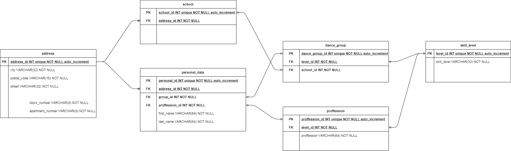
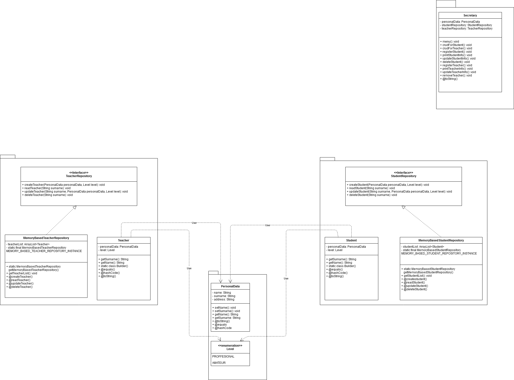

## Table of contents
* [General info](#general-info)
* [Technologies](#technologies)
* [Setup](#setup)

## General info
This project is inspired by private lessons dureing I practice my skills and accelerate personal development

## Technologies
Project is created with:
* Gradle
* JAVA 15.0.1.
* draw.io
* JUNIT5


## Setup
To run this project, install it locally using:

```
$ 
$ FORK from git
$ 
```
###Database relation graph:


###Objects relation graph:


